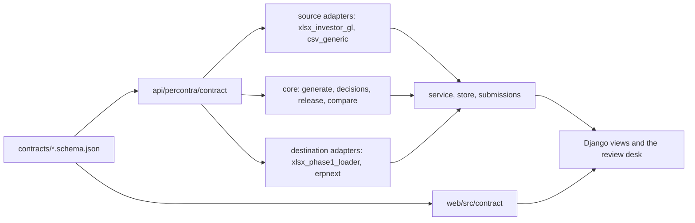

# Per Contra

A migration review desk for fund accountants: resolve a mapping gap, approve a complete batch, export it, and trace any amount back to its source and decision versions.

## The problem

> "What I care about is the count of turns. That is the drag on my time."
>
> Fund manager, `call-1-nav-workflow-review.md:100-111`

He describes six review turns on one NAV pack, each one a resubmission after a problem surfaced that the previous turn had hidden. The migration dataset shows the same thing in a spreadsheet: two accounting decisions affecting 19 postings, treatments already in the verified upload, approval cells blank (`Mapping Gaps!A2:G3`). The transcript attests the problem, repeated review because approval and output drift apart; the workbook attests one instance of it. The migration did not cause his six turns and this build does not fix his NAV; it is the supplied workflow on which the fix is shown.

Per Contra binds an approval to the exact decision versions it was granted on. When a decision changes, the approvals that relied on it go stale instead of silently re-exporting, and the accountant sees which batches need another look and which do not. That is one turn instead of the next three.

## Run it

```sh
just demo
```

Requires uv, pnpm, Node and just. Opens one Django-served app at http://localhost:8080 after building the frontend. Click **Public example** to exercise the real review engine without client files or vendor credentials. It is clearly labelled synthetic and cannot be sent to ERPNext.

For dataset 02, place the private workbooks as described in [data/README.md](data/README.md), then click **Load dataset 02**. You can also upload your own copies of the source and reference workbooks through the same screen.

## What works

1. Read source GL and crosswalks with file SHA-256, sheet and physical row evidence. Preserve duplicate occurrences.
2. Generate three complete, explicitly selected batches. The verified upload sheet is used only for comparison.
3. Record an expense-mapping decision with an author, accounting reason and version.
4. Approve a complete resolved batch. A dependency change makes its approval stale; reverting a value does not resurrect it.
5. Export a 27-column Phase I workbook and retain its bytes and digest locally. Click an amount to inspect source rows, mapping versions, decision history and approval.
6. Optionally provision company-scoped ERPNext accounts, create a draft journal, submit it, then read the journal and GL entries back. An uncertain response is never blindly retried.

The real-data checks reproduce **152 of 152 Chalbury rows on ten selected identity, classification and amount fields**, with USD 127.19 debit and credit. This is not a claim to reproduce all 18,929 reference rows or every loader field.

Westvale provides 11 documented gap rows in a 44-row batch. DJ3 provides eight documented gap rows in a 652-row batch, but additional unsupported mappings remain blocked. Neither is relabelled as Chalbury or sent to its company.

## Adapter honesty

Two file adapters are backed by dataset 02: its source GL and the Phase I loader format. There is also an explicit-column-profile CSV source for programmatic use, one optional live ERPNext destination, and three declared-but-unverified destinations: Entrilia, Sage Intacct and FIS Investran. No access to those three systems is claimed.

| Adapter | Source evidence | Investor rows | Decision author/reason | Destination receipt | Change impact |
|---|---|---|---|---|---|
| xlsx_investor_gl | verified | verified | not applicable | not applicable | partial |
| csv_generic | verified | verified | not applicable | not applicable | partial |
| xlsx_phase1_loader | partial | verified | partial | not applicable | partial |
| erpnext | partial | partial | partial | unverified | unverified |
| entrilia | unverified | unverified | unverified | unverified | unverified |
| intacct | unverified | unverified | unverified | unverified | unverified |
| investran | unverified | unverified | unverified | unverified | unverified |

This table is checked against `adapters.registry.catalog()`, also served at `GET /api/adapters`. ERPNext protocol tests pass against controlled responses; live acceptance remains unverified until a receipt actually reaches `verified`. A file export always says **Exported; destination not checked**.

ERPNext is a general ledger, not a fund administration engine. Investor allocation, source evidence and decision history remain in Percontra; journal-line remarks link back to posting IDs. We do not claim native investor capital accounts, waterfalls, or a verified target-system import for the loader file.

## Existing ERPNext site

Only https://percontra.l.frappe.cloud and **Chalbury Co-Invest L.P.**, abbreviation CCI, are authorised. No other company may receive writes.

Credentials are read server-side from the ignored root `.env` or environment variables: `ERPNEXT_URL`, `ERPNEXT_API_KEY`, `ERPNEXT_API_SECRET`. Do not use `VITE_` prefixes, commit them, or include them in a public deployment.

```sh
just live
```

Stop the ordinary server first; both commands use port 8080. Live mode binds only to loopback. In the UI:

1. Check the connection. The company must report USD, the 2026 fiscal year must cover the posting date, and Main - CCI must be an active leaf cost center.
2. Load dataset 02, select Chalbury 639661, review and approve its 152 rows.
3. Preview accounts, then explicitly create missing accounts. Matching USD accounts are reused; conflicts stop the operation.
4. Confirm the company, then click **Post once and verify**.
5. Open the ERPNext journal from its receipt. **Verify again** is read-back, not another posting.

Current live check: the API still reports **GBP**, with zero journal and GL entries. The adapter correctly blocks posting. Company currency is not changed automatically; correcting its company/default-account setup is separate from creating migration accounts.

A saved draft is not posted. `verified` requires a submitted journal with matching lines, exchange rates and currencies, plus matching account-level GL totals. A timeout yields `unknown`; a recovered draft stays `draft_saved`. No automatic draft resubmission, cancellation, deletion or reposting.

## Structure and contract



The contract sits in the middle and everything derives from it. Core reads the contract and the standard library only; it never imports an adapter, the store, Django or DuckDB, and `tests/test_migration.py::test_core_has_no_adapter_or_persistence_imports` fails the build if that changes.

```text
contracts/                      authoritative JSON schemas
api/percontra/contract/          generated Pydantic models
api/percontra/core/              generation, decisions, release and comparison
api/percontra/adapters/          source/destination protocols, registry and implementations
api/percontra/service.py         local orchestration
api/percontra/store.py           retained inputs and append-only events in DuckDB
api/percontra/submissions.py     persisted submission intents and receipt state machine
web/src/contract/migration.ts    generated TypeScript wire types
web/src/features/migration/      review desk and evidence dialog
```

Core imports contracts and the standard library only. [Contract notes](docs/posting-contract.md) describe the invariants. [Implementation plan](docs/erpnext-plan.md) records scope and verification.

`data/migration.duckdb` retains runs, decisions, approvals and receipts. `data/exports/` retains exported bytes, and `data/uploads/` retains uploaded originals. Back up these together. This is application-level append-only history, not a tamper-proof or distributed ledger.

## Verify

The four tests that carry the product claim are in `api/tests/test_product_claims.py`, one per sentence: a release goes stale on a new decision version, an unaffected batch stays approved, export refuses a stale batch, duplicate occurrences are kept as a multiset.

```sh
just test
just lint
just coverage
just contracts-check
pnpm --dir web typecheck
pnpm --dir web test:run
pnpm --dir web build
uv run --directory api --with playwright python ../scripts/verify_ui.py
```

CI (`.github/workflows/ci.yml`) runs three jobs on every push: `web` (oxfmt, tsc, oxlint, knip, audit, Vitest, build, size-limit, Playwright with the HTML report uploaded as an artifact), `api` (ruff, pyrefly, pytest with coverage, contract drift), and `container` (the Dockerfile builds). `just lint` and `pnpm --dir web ci:local` are the local mirrors.

The browser check needs Playwright Chromium installed. It runs against a disposable local database and never enables ERPNext writes. Private-data tests skip when dataset 02 is absent; public fixtures still exercise generation, revisions, approval invalidation, export and receipt handling.

## Limits and publishing

The app is a single local operator process, not a multi-user service. Mutations require a loopback caller, local hostname and CSRF token. A reviewer name is an attributed local decision, not authenticated identity.

Dataset 01, arbitrary fund systems, full-loader parity, live reversal/repost workflows and production deployment are outside this build. CSV needs a supplied column map and reference registries; it has no automatic schema inference or dedicated upload UI.

Client workbooks, databases, exports and credentials are excluded from Git and Docker. A hosted copy must use public fixtures only and contain no ERPNext credentials. No hosting, commit or push is performed by this implementation.

## What we would do next

1. A second live destination with a real receipt, so `destination_receipt` reaches `verified` for something other than a file.
2. Mapping edits inside the desk, versioned like decisions, so a crosswalk change goes through the same stale-and-reapprove path.
3. Multi-user state: a session per reviewer and a server that is not loopback-only.

ERPNext integration follows the [Frappe REST API](https://docs.frappe.io/framework/user/en/api/rest), [Journal Entry documentation](https://docs.frappe.io/erpnext/journal-entry), and [document submission implementation](https://github.com/frappe/frappe/blob/version-15/frappe/client.py).
