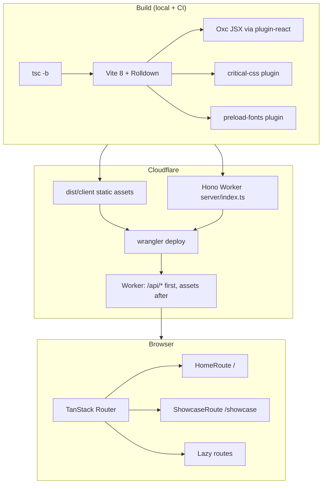

# Architecture: vite-template

**Status:** Living document  
**Last updated:** 2026-07-11

This template is a **design-forward frontend starter**, not a minimal empty shell. `/` is a lean product home; `/showcase` lazy-loads the design-system preview. Routing, auth seams, i18n, analytics, a thin Hono Worker API, and Cloudflare deploy plumbing are production-shaped so a clone can grow into a product without re-scaffolding.

---

## System context



| Concern         | Choice                               | Where                                            |
| --------------- | ------------------------------------ | ------------------------------------------------ |
| Runtime         | React 19 SPA                         | `src/main.tsx`                                   |
| Routing         | TanStack Router (SPA)                | `src/router.tsx`                                 |
| Styling         | Tailwind v4 + shadcn (Base UI, nova) | `src/index.css`, `src/components/ui/`            |
| Bundler         | Vite 8 -> Rolldown                   | `vite.config.ts`                                 |
| JSX transform   | Oxc (not Babel)                      | `@vitejs/plugin-react`                           |
| API             | Hono on Workers (`/api/*`)           | `server/index.ts`, shared `src/contract/`        |
| Hosting         | Cloudflare Workers (Worker + assets) | `wrangler.jsonc` (`main` + `assets`)             |
| Node            | 24.18.0 LTS via **fnm**              | `.node-version`, `engines` in `package.json`     |
| Package manager | pnpm 11                              | `package.json` `packageManager`                  |
| Formatter       | oxfmt                                | `pnpm format` / `format:check`, `.oxfmtrc.json`  |
| Linter          | oxlint (full tree, type-aware)       | `.oxlintrc.json`, `pnpm lint`, `oxlint-tsgolint` |
| Types           | `tsc -b` (strict)                    | `pnpm typecheck`                                 |
| Unit tests      | Vitest + happy-dom                   | `pnpm test:run`                                  |

Full decision map: [tooling.md](./tooling.md). See [ADR 002](../adr/002-oxc-rolldown-build-toolchain.md), [ADR 003](../adr/003-in-app-design-showcase.md), [ADR 005](../adr/005-tooling-and-spa-spine.md), and [ADR 006](../adr/006-hosted-auth-identity.md) (auth stays hosted; WorkOS JWKS verification, no database) for rationale.

---

## Layer model

Imports should flow **down** the stack. Do not import routes from `lib/`, or `features/` from `ui/` primitives in reverse.

```
routes/          URL-bound screens, loaders, middleware
    ↓
features/        Composed product flows (chat today)
    ↓
components/      App-level UI (theme, copy-button, showcase sections)
    ↓
components/ui/   shadcn primitives + chat presentation layer
    ↓
lib/             Framework-agnostic logic (auth seam, session, transport)
    ↓
hooks/           Reusable React hooks

contract/        Wire contract (zod schemas + fixtures); imported by client AND Worker
server/          Hono Worker (outside src/; imports src/contract only)
```

### `server/`

The Hono Worker behind `/api/*` (`wrangler.jsonc` `main`). `server/auth.ts` is the single verification middleware: jose JWKS verification of WorkOS AuthKit access tokens, issuer-pinned, fail-closed ([ADR 006](../adr/006-hosted-auth-identity.md)). `server/index.ts` serves `GET /api/dashboard` and `GET /api/session`, applies `secureHeaders()` and a same-origin check on mutations, and answers errors as RFC 9457 problem+json (`server/problem.ts`). No database; sessions are stateless JWTs.

### `src/contract/`

The shared wire contract: `dashboard.ts` (types + `dashboardDataSchema`), `problem.ts`, `session.ts`, and `dashboard-fixtures.ts` (demo data both the client fallback and the Worker serve). Client and Worker import from here so the two sides cannot drift; it must stay dependency-light (zod only).

### `src/routes/`

Route components and **auth gate**. Protected screens live under the pathless `src/routes/_authenticated/` layout whose `beforeLoad` runs `requireAuth` (`src/lib/require-auth.ts`); it reads `getSession()` from `lib/session.ts` and redirects unauthenticated users to `/login`. Protection is a property of file location, not a per-route ritual ([ADR 006](../adr/006-hosted-auth-identity.md)); the client guard is UX only, the Worker verifies sessions server-side. File routes live under `src/routes/`; the generated tree is `src/routeTree.gen.ts`.

### `src/features/`

Product-shaped composition built from primitives. Today only `features/chat/` (`ChatFeature`). Add new domains here (`features/billing/`, etc.) rather than bloating route shells.

### `src/components/showcase/`

Sections for the **template preview** on `/showcase`. Not product code. Delete when the preview is no longer needed. See [Template -> product](#template--product-migration).

### `src/components/ui/`

shadcn-owned primitives. Treat as a **library surface**: knip ignores this tree; oxlint enforces `only-export-components`. Chat primitives live in `ui/chat/`; import from `@/components/ui/chat`.

### `src/lib/`

Extension seams: swap implementations without touching UI:

| Module               | Role                                                                                                                              |
| -------------------- | --------------------------------------------------------------------------------------------------------------------------------- |
| `auth-provider.tsx`  | WorkOS AuthKit SPA (env-gated; readiness barrier; safe return path; session bridge)                                               |
| `sign-out.ts`        | Clears local + hosted WorkOS session when AuthKit is live                                                                         |
| `session.ts`         | Demo/`setLiveSession` for `beforeLoad`; server truth is `/api/session` (ADR-6: hosted auth, Better Auth deliberately not adopted) |
| `analytics.ts`       | PostHog seam (dynamic import, SDK opt-in)                                                                                         |
| `error-reporting.ts` | Sentry seam (dynamic import, SDK opt-in, env-gated `VITE_SENTRY_DSN`)                                                             |
| `chat-transport.ts`  | Scripted transport; swap for `@ai-sdk/react` or your API                                                                          |
| `view-state.ts`      | Discriminated unions for resource + mutation phases (no boolean soup)                                                             |
| `motion.ts`          | Duration/easing tokens (seconds), character registers, presence presets                                                           |
| `env.ts`             | `@t3-oss/env-core` + Zod for `VITE_*` vars                                                                                        |

### Motion foundation

Default character is **standard** (brief: punctuation, not spectacle). CSS owns hover/press; Motion only loads where enter/exit or scroll reveal needs it.

| Piece               | Where                              | Contract                                                                                                          |
| ------------------- | ---------------------------------- | ----------------------------------------------------------------------------------------------------------------- |
| CSS tokens          | `styles/theme-tokens.css`          | `--motion-fast` to `slower` (120-600ms); `--ease-out` / `in-out` / `emphasized` / `soft`                          |
| Tailwind aliases    | same file                          | `duration-fast                                                                                                    | base | normal | medium | slow | slower`, `ease-out` etc. |
| JS tokens + presets | `lib/motion.ts`                    | `MOTION_DURATION`, `character.*`, `panelPresence`, scroll reveal helpers                                          |
| Lazy provider       | `components/motion-shell.tsx`      | `LazyMotion` + `MotionConfig reducedMotion="user"` + character register; **lazy on `/showcase` and `/dashboard`** |
| Primitives          | `components/motion-primitives.tsx` | `FadeIn` / `FadeInGroup` (marketing budget), `PresencePanel`                                                      |
| Reduced motion      | `index.css` + MotionConfig         | CSS floor; spinners keep spinning; JS respects OS setting                                                         |

Do not put `LazyMotion` on the entry path (`main.tsx`); home and login stay CSS-only. When a product route needs `m` / `AnimatePresence`, wrap that route (or a feature layout) in `MotionShell` and pick a character register.

### UI state foundation

Non-happy paths share one vocabulary and a small set of primitives so every route does not re-invent loading, empty, error, partial, conflict, and offline:

| Piece             | Where                                                     | Contract                                                  |
| ----------------- | --------------------------------------------------------- | --------------------------------------------------------- |
| Status types      | `lib/view-state.ts`                                       | `ResourceResult`, `MutationPhase`, `UNKNOWN_METRIC` (`-`) |
| Loading           | `components/loading-surface.tsx` + `useLoadingEscalation` | ~200ms delay, layout-matched skeleton, 5s slow escalate   |
| Empty             | `components/ui/empty.tsx`                                 | why + CTA + visual                                        |
| Error             | `components/error-state.tsx`                              | what / why / retry + support ID + copy                    |
| Partial metric    | `components/metric-value.tsx`                             | never `N/A` / null / fake zero for unknown                |
| Offline shell     | `components/offline-banner.tsx` in `RootLayout`           | queue-and-sync copy; features still disable local writes  |
| Reference lattice | `showcase/states-showcase.tsx`                            | full 7-state matrix for visual QA                         |

Write surfaces (chat, login) use `MutationPhase`; read surfaces (dashboard loader) use status-tagged results. Impossible boolean combos (`isLoading && !error && data`) are a finding; prefer the unions above.

### Server state: reads and writes

Reads go through route loaders plus `ensureQueryData` (already the pattern; see `lib/query-client.ts` and the dashboard loader). The first real mutation follows TanStack Query's division of labor: optimistic updates that touch a shared cache belong in `onMutate`/`onError`/`onSettled` on the mutation; optimism visible in a single component reads `mutation.variables` while the mutation is pending; React's `useOptimistic` is only for local action state that never enters the query cache. The chat IndexedDB queue (`lib/offline-queue.ts`) is the offline-transport example, not the pattern for shared-cache writes. In unit tests, server state comes from MSW handlers in `src/test/mocks/` mirroring the Worker routes, never hand-stubbed `fetch`.

---

## Bootstrap and provider tree

`src/main.tsx` wraps the router:

```
ErrorBoundary
   ->  ThemeProvider
     ->  QueryClientProvider
       ->  AuthProvider (children directly, or AuthKitProvider after readiness)
         ->  RouterProvider
         ->  Toaster

# /showcase (and any route that imports m / AnimatePresence)
MotionShell (lazy)
   ->  LazyMotion + MotionConfig(character.standard, reducedMotion="user")
     ->  route UI
```

**Theme FOUC:** inline script in `index.html` applies `.dark`/`.light` before paint. **Critical CSS:** `src/critical.css` is a scoped Tailwind entry; `vite/plugins/critical-css.ts` inlines it at build close and async-loads the full stylesheet.

### System theme detection

There is **no polling**. Both the inline script and `ThemeProvider` use the same event-driven `matchMedia` listener:

```js
const query = matchMedia("(prefers-color-scheme: dark)");
query.addEventListener("change", (event) => {
  if (currentMode === "system") apply(event.matches ? "dark" : "light");
});
```

The browser fires the `change` event only when the OS color scheme actually flips, so the page reacts automatically without timers or repeated checks. The inline script attaches the listener immediately so the static shell updates even before React hydrates; `ThemeProvider` re-attaches its own listener on mount and removes it when the user leaves `system` mode, so an explicit light/dark choice is never overridden by a later OS change.

---

## Routing and code-splitting

| Path         | Loading                | Notes                                 |
| ------------ | ---------------------- | ------------------------------------- |
| `/`          | Eager (`HomeRoute`)    | Lean product home; small entry bundle |
| `/showcase`  | Lazy (`ShowcaseRoute`) | Full design-system preview            |
| `/dashboard` | Lazy + loader          | `requireAuth` middleware              |
| `/login`     | Lazy                   | Demo login + optional WorkOS button   |
| `*`          | Eager                  | In-app 404                            |

**Prefetch:** TanStack Router owns component splitting and `Link` intent preloading. Manual intent sites call `router.preloadRoute`, which warms the component and runs its loader. `defaultPreloadStaleTime: 0` prevents preload data from masking navigation revalidation.

**Additional splits:** `ShowcaseRoute` (lazy), WorkOS (`lazy` `AuthProvider` in `main.tsx`, `workos-login-button` in login), PostHog (`dynamic import` in `analytics.ts`). When SDK packages are not installed, `vite/plugins/optional-seams.ts` supplies build-time stubs so the graph still resolves.

**Known gap:** WorkOS-related chunks may still overlap depending on import graph; re-audit with `ANALYZE=1 pnpm build` when OAuth is a launch requirement. See [slimming-reference.md](../synthesis/slimming-reference.md#open-questions-intentionally-unresolved).

---

## Build pipeline

```
pnpm build
   ->  wrangler types + tsr generate  # cf-typegen, routes:gen
   ->  tsc -b tsconfig.json server/tsconfig.json   # typecheck only (app + worker); no emit
   ->  vite build      # Rolldown bundle
       ->  react() + tailwindcss()
       ->  preloadFontsPlugin()      # vite/plugins/preload-fonts.ts
       ->  criticalCssPlugin()       # vite/plugins/critical-css.ts (skipped under VITEST)
       ->  cloudflare()              # workerd-faithful dev/build (skipped under VITEST)
```

With a Worker `main` configured, the Cloudflare plugin splits the output: client assets land in `dist/client/`, the Worker bundle in its own `dist/` subfolder, and a generated wrangler config (plus a `.wrangler/deploy` redirect) tells `wrangler deploy` what to upload.

**Vitest guard:** `process.env.VITEST` disables Cloudflare and critical-css plugins so unit tests do not boot workerd (the plugin targets the Workers runtime; the unit suite is client-only happy-dom). The workerd-faithful dev/preview/build is the point of the plugin: `public/_headers`, `_redirects`, `not_found_handling`, and the `/api/*` Worker behave locally exactly as in production. Drop the guard only if Worker-side tests move to `@cloudflare/vitest-pool-workers`.

**Analysis:** `ANALYZE=1 pnpm build` enables `rollup-plugin-visualizer` -> `dist/stats.html`.

**Custom plugins** live under `vite/plugins/`; not a root-level `plugins/` folder.

---

## Deploy

1. `vite build` writes `dist/client/` (static assets) plus the Worker bundle and a generated wrangler config that `wrangler deploy` follows via `.wrangler/deploy`.
2. `wrangler deploy` uploads the Hono Worker (`server/index.ts`, `main` in `wrangler.jsonc`) together with the static assets; `run_worker_first: ["/api/*"]` routes API requests to the Worker before asset matching, everything else serves assets with SPA not-found handling.
3. `public/_headers` applies security headers to assets (`/assets/*` immutable-cached); API responses get `secureHeaders()` inside the Worker.
4. CI: `.github/workflows/deploy.yml` deploys the exact `main` commit only after its `ci` workflow succeeds and when `CLOUDFLARE_API_TOKEN` is set.

---

## Testing pyramid

| Layer            | Tool                       | Scope                                                                                                                                               |
| ---------------- | -------------------------- | --------------------------------------------------------------------------------------------------------------------------------------------------- |
| Unit / component | Vitest + happy-dom         | Colocated `*.test.ts(x)` under `src/`, `server/`, and `vite/plugins/`                                                                               |
| Network doubles  | MSW (node server)          | `src/test/mocks/{server,handlers}.ts` derive handlers from `src/contract/`; setup runs `onUnhandledRequest: "error"` so unmocked fetches fail tests |
| Coverage gate    | `@vitest/coverage-v8`      | **`src/lib/**` 80%** + **`src/hooks/**` 90%** lines/functions (optional seams excluded)                                                             |
| E2E              | Playwright                 | `e2e/**` in CI                                                                                                                                      |
| CI               | `.github/workflows/ci.yml` | oxfmt, tsc, oxlint, knip, audit, vitest+coverage, build, size-limit, perf, Playwright                                                               |

Coverage `include` is `src/lib/**` + `src/hooks/**`. Excluded from the gate (optional/dead seams, knip-aligned): `auth.ts`, `auth-provider.tsx`, `concentric-radius.ts`, `use-mobile.ts`. UI primitives and showcase sections are tested selectively, not under thresholds; intentional for template velocity.

---

## Quality gates

| Check               | Local (prek) | CI  |
| ------------------- | ------------ | --- |
| oxfmt               | yes          | yes |
| `tsc -b --noEmit`   | yes          | yes |
| oxlint (full tree)  | yes          | yes |
| knip                | -            | yes |
| `pnpm audit --prod` | -            | yes |
| size-limit          | -            | yes |

prek and CI both run oxlint over the whole tree; only the `react/only-export-components` rule is scoped to UI primitives (`src/components/ui/**` plus the motion files), not the lint run itself.

Current size budgets (`package.json#size-limit`, paths under `dist/client/assets/`): home boot JavaScript aggregate (113 kB brotli), showcase route shell (48 kB), motion shell (14 kB, lazy with `/showcase` and `/dashboard`), and CSS aggregate (27 kB). The home budget includes every JavaScript chunk except explicit prefixes mirrored from `DEFERRED_CHUNK_PREFIXES`, so a new chunk is covered by default. Re-measure when adding heavy product routes. Rationale and regression notes: [slimming-reference.md](../synthesis/slimming-reference.md#9-size-limit-budgets).

---

## Language and theming

- **Language:** English copy is literal in components and the document keeps `<html lang="en">`. Internationalization is opt-in for product forks; there is no dormant locale store or translation abstraction (ADR 032).
- **Theming:** `ThemeProvider` + OKLCH tokens in `src/styles/theme-tokens.css`. Edit palette via tweakcn -> paste into `@theme` blocks.
- **Fonts:** Inter for UI, Charter for prose (self-hosted). Latin woff2 preloads (Inter latin + Charter regular) via `vite/plugins/preload-fonts.ts`; metric-matched Arial/Georgia fallback faces in `theme-tokens.css`.

---

## Template -> product migration

When forking for a real app, work through this in order:

1. **Replace `/`**: customize `src/routes/index.tsx` for your product landing (and keep the static shell in `index.html` byte-identical). Remove unused `src/components/showcase/*` when the preview is no longer needed.
2. **Re-tighten budgets**: lower the `size-limit` entries in `package.json` when entry JS/CSS grows.
3. **Wire live auth**: set `VITE_WORKOS_CLIENT_ID` (client) and `WORKOS_CLIENT_ID` (Worker var); server-side verification already ships (`server/auth.ts` JWKS middleware, [ADR 006](../adr/006-hosted-auth-identity.md)). Remove the demo session when live-only.
4. **Extend the API**: the Hono Worker (`server/index.ts`) already serves `/api/*` on the same origin; add routes there and grow `src/contract/`, or point `VITE_API_BASE_URL` at an external API. Server stack choice for a bigger backend: [ADR 035](../adr/035-hono-on-workers-not-nitro.md) (default for CF-locked apps: Hono on Workers, not Nitro).
5. **SEO**: launch gate when crawlers must see body HTML beyond the home static shell: prerender via TanStack Start's prerendering (same router; Start is v0, evaluate at fork time). vite-react-ssg does not support file-based TanStack Router (verified 2026-07-10). The home route stays covered by the static shell in `index.html`.
6. **CSP**: add to `public/_headers` once PostHog/WorkOS origins are finalized.
7. **Expand E2E**: add specs per real route; consider mobile viewport and a11y automation.

---

Open template-owed work lives in [TODO.md](../TODO.md). Fork-time gaps live in [template-gaps.md](../frontend/template-gaps.md).

## Related documentation

| Doc                                                         | Content                              |
| ----------------------------------------------------------- | ------------------------------------ |
| [adr/README.md](../adr/README.md)                           | Accepted architectural decisions     |
| [tooling.md](./tooling.md)                                  | Current toolchain policy             |
| [env.md](./env.md)                                          | Env contract                         |
| [deploy-checklist.md](./deploy-checklist.md)                | Per-deploy checks; CSP recipe        |
| [incident-response.md](./incident-response.md)              | Severity scale, comms, postmortem    |
| [detach-cloudflare.md](./detach-cloudflare.md)              | Exit ramp for non-Cloudflare forks   |
| [slimming-reference.md](../synthesis/slimming-reference.md) | July 2026 slimming pass (historical) |
| [template-gaps.md](../frontend/template-gaps.md)            | Fork board                           |
| [README.md](../../README.md)                                | Clone, scripts, tooling division     |
| `.claude/CLAUDE.md`                                         | Agent guardrails and conventions     |
